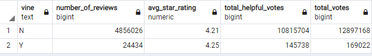

# AWS_Kitchen_Reviews_Analysis
PySpark and Big Data using AWS, S3, Postgres

Amazon provides downloadable datasets with product reviews.  The review datasets are presented by product category.  The "US Kitchen" category was chosen for this analysis.  You can find the datasets here: https://s3.amazonaws.com/amazon-reviews-pds/tsv/index.txt.  The dataset was 

## ETL
Utilizing Spark in Google's Colab Notebooks, the dataset was pulled into a dataframe and transformed into four different dataframes.  Each dataframe was cleaned and checked for fit to the schema.  The schema is https://github.com/mspamelalea/AWS_Kitchen_Reviews_Analysis/blob/master/schema.sql. 
Once the four datframes were clean, they were each loaded to an AWS RDS. 

You can find the Google Colab Notebook with the code here:
https://colab.research.google.com/drive/1nU_VN1fBdjUWQi0jBE5DR3V457YkKuzu?usp=sharing

## Analysis
The AWS RDS was a Postgres database that was accessed through pgAdmin.  There, several SQL statements were used to summarize the data in the vine_table.  

The goal of this analysis is to determine if Vine (paid) reviews are trustworthy when compared to all the other non-Vine (unpaid) reviews.

Overall Comparison

Overall Aggregates

The overall overage star ratings are very similar and do not show an overall bias.

1-Star Comparison

The percentage of 1-star helpful votes are different by only 1.4% and do not show an overall bias.

2-Star Comparison

The percentage of 2-star helpful votes are different by only 1.8% and do not show an overall bias.

3-Star Comparison

The percentage of 3-star helpful votes are different by only 2.7% and do not show an overall bias.

4-Star Comparison

The percentage of 4-star helpful votes are different by only minute percentage and do not show an overall bias.

5-Star Comparison

The percentage of 5-star helpful votes are different by only 1.1% percentage and do not show an overall bias.

After reviewing this data, it is apparent that Vine reviews for Kitchen Category on Amazon are trustworthy.